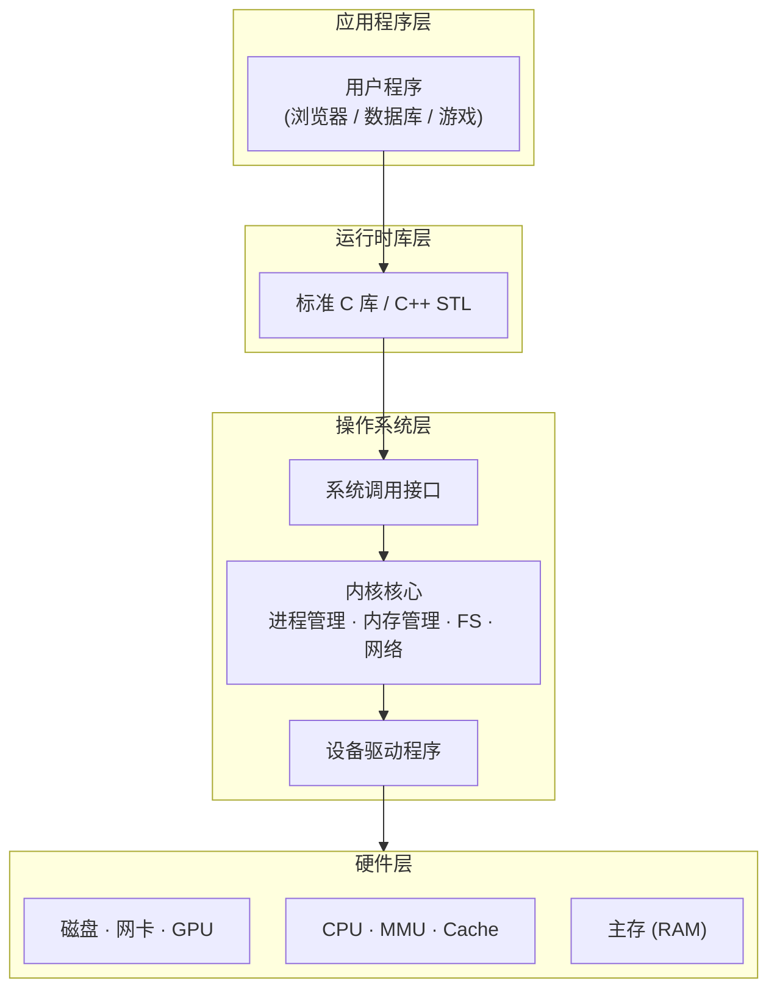

---
tags:
  - cs/fundamentals
status: 🌱
---

> [!important] **核心考点**：计算机系统的层次抽象模型、每层屏蔽下层细节、抽象是控制复杂度的核心手段

## 抽象层次模型

每一层**隐藏下层实现细节**，仅暴露接口给上层：

## 抽象的好处与代价

| 好处 | 代价 |
|------|------|
| 管理复杂度 | 性能开销（函数调用、上下文切换） |
| 可移植性 | 信息隐藏（无法利用底层优化） |
| 模块化独立演进 | 抽象泄漏（下层限制渗透到上层） |

> [!tip]- **工程要点**：**所有非平凡抽象都是有泄漏的**（Joel 定律）。理解底层有助于写出更好的上层代码。

---

计算机本质与软硬件关系详见 → [What is a Computer（计算机本质）](/01-CS%20Core%20(计算机核心基础)/01-Computer%20Fundamentals（计算机基础）/01-Computer%20Overview（计算机系统总览）/01-What%20is%20a%20Computer（计算机本质）.md) · [Hardware vs Software（软硬件关系）](/01-CS%20Core%20(计算机核心基础)/01-Computer%20Fundamentals（计算机基础）/01-Computer%20Overview（计算机系统总览）/02-Hardware%20vs%20Software（软硬件关系）.md)
