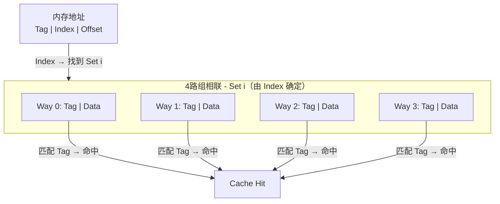

---
tags:
  - cs
  - computer-org
status: 🌱
---

> [!important] **核心考点**
> Cache 映射方式（直接/组相联/全相联）、替换策略（LRU/LFU/FIFO）、写策略（写直达/写回）

## Cache 基本结构

Cache 以**缓存行（Cache Line）** 为单位存储数据，通常 64 字节。

```
Cache = 若干组（Set），每组 = 若干路（Way，即缓存行）
总大小 = 组数 × 路数 × 缓存行大小
```

## 映射方式

| 方式 | 描述 | 组/路 | 特点 |
|------|------|-------|------|
| **直接映射** | 每个内存块只能映射到固定行 | 1 路/组 | 简单但冲突 miss 高 |
| **全相联** | 任意块可映射到任意行 | 1 组，全路 | 灵活但比较慢 |
| **组相联** | 每个块映射到固定组内的任意行 | N 路/组 | **最常用** |



## 替换策略

当组内所有路都填满，且缓存 miss 时，需要选择一路淘汰：

| 策略 | 描述 | 复杂度 | 效果 |
|------|------|--------|------|
| **LRU** | 淘汰最久未访问的行 | 高 | 最好，接近最优 |
| **伪 LRU** | 近似 LRU，用二叉树跟踪 | 中 | 很好，实用 |
| **FIFO** | 淘汰最早进入的行 | 低 | 一般（可能淘汰热点） |
| **随机** | 随机选择淘汰 | 最低 | 尚可，简单 |

## 写策略

| 策略 | 写入时 | 优点 | 缺点 |
|------|--------|------|------|
| **写直达 (WT)** | 同时写 Cache 和主存 | 一致性简单 | 慢（每次写穿透到主存） |
| **写回 (WB)** | 只写 Cache，标记脏位 | 快（减少写主存） | 一致性复杂 |

现代 CPU 使用**写回策略**，配合**写缓冲**（Write Buffer）暂存待写回的数据。

## 缓存相关的性能陷阱

### False Sharing（伪共享）

```cpp
// 多线程写同一 cache line 的不同变量 → 性能暴跌！
struct Data { int a; int b; };  // a 和 b 在同一 cache line
Data data;
Thread 1: data.a++;  // 使 Thread 2 的缓存行失效
Thread 2: data.b++;  // 使 Thread 1 的缓存行失效
// 持续缓存一致性流量，比单线程还慢！

// 解决：缓存行对齐
struct alignas(64) Data { int a; int b; };  // 分属不同 cache line
```

---

> [!tip]- **工程要点**
> 现代 CPU 的写回策略配合写缓冲兼顾了性能和一致性；伪共享是多线程编程中最隐蔽的性能陷阱之一，通过缓存行对齐即可解决。
>

存储层级全景图见 → [Memory Hierarchy](../03-Memory%20Hierarchy（存储层级结构⭐）.md)
