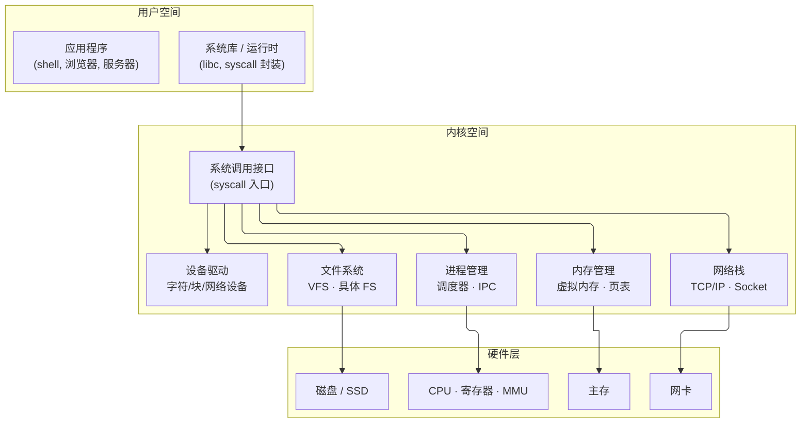

---
tags:
  - cs/os
status: 🌱
---

> [!important] **核心考点**：OS 四大功能、内核态 vs 用户态、系统调用、操作系统类型与架构

## 操作系统定义

操作系统是管理计算机硬件和软件资源的系统软件，提供用户与计算机之间的接口。

### 四大功能

| 功能 | 说明 |
|------|------|
| **进程管理** | 创建/调度/同步/通信进程 |
| **内存管理** | 地址空间分配、虚拟内存、页表管理 |
| **文件系统** | 文件存储、目录结构、权限控制 |
| **I/O 管理** | 设备驱动、中断处理、DMA |

### 内核态 vs 用户态

```cpp
// 系统调用示例（C++ 中调用 Linux 系统调用）
#include <unistd.h>
#include <iostream>

int main() {
    // 用户态 → 系统调用 → 内核态
    write(STDOUT_FILENO, "Hello\n", 6);  // write 是系统调用
    // 另一种形式
    syscall(SYS_write, STDOUT_FILENO, "Hello\n", 6);
    return 0;
}
```

- **内核态**：可执行特权指令，访问所有硬件资源
- **用户态**：受限执行，通过系统调用（`int 0x80` / `syscall` 指令）陷入内核

### 系统调用流程

```
用户程序 → write() (libc 封装) → syscall 指令 → 内核 sys_write → 返回用户态
```

---

## 操作系统类型

| 类型 | 特点 | 代表 |
|------|------|------|
| 批处理 OS | 批量运行作业，无交互 | IBM OS/360 |
| 分时 OS | 时间片轮转，交互式 | Unix, Linux |
| 实时 OS | 严格时间约束，确定性 | RT-Linux, FreeRTOS |
| 分布式 OS | 多机统一资源管理 | Amoeba |
| 嵌入式 OS | 资源受限，专用性强 | VxWorks, µC/OS |

### 宏内核 vs 微内核

```cpp
// 宏内核（Linux）：驱动在内核空间，性能好但崩溃影响大
// 微内核（Minix, QNX）：驱动在用户空间，稳定但 IPC 开销大
```



---

## 操作系统启动流程（x86）

```
BIOS/UEFI → 引导加载程序（GRUB）→ 内核解压 → start_kernel → init 进程
```

1. **BIOS/UEFI**：POST 自检，加载引导扇区
2. **Bootloader（GRUB）**：选择内核，加载到内存
3. **内核初始化**：`start_kernel()` 初始化调度器、内存管理、中断
4. **init 进程**：PID=1，启动用户态服务（systemd）

---

## 经典题型速查

| 题型 | 要点 |
|------|------|
| 系统调用开销 | 上下文切换（保存用户态寄存器→恢复内核态→切换页表） |
| 内核态 vs 用户态切换代价 | ≈ 1-10μs，比函数调用慢 100-1000 倍 |
| Linux 的 `copy_on_write` | fork() 时父子共享页，写时复制（COW） |
| 中断与系统调用的区别 | 中断异步（硬件触发），系统调用同步（主动触发） |
| 操作系统的设计哲学 | 机制（mechanism）与策略（policy）分离 |

> [!tip]- **工程要点**：系统调用是用户态与内核态的唯一入口，每次 syscall 涉及特权级切换（ring 3 → ring 0），是性能关键路径。批量系统调用（如 readv/writev）比多次单调用明显更快。

---


进程线程与上下文切换详见 → [Process vs Thread（进程与线程）](/01-CS%20Core%20(计算机核心基础)/03-Operating%20System（操作系统）/01-Process%20vs%20Thread（进程与线程⭐）.md) · [Context Switching（上下文切换）](/01-CS%20Core%20(计算机核心基础)/03-Operating%20System（操作系统）/02-Context%20Switching（上下文切换）.md)
