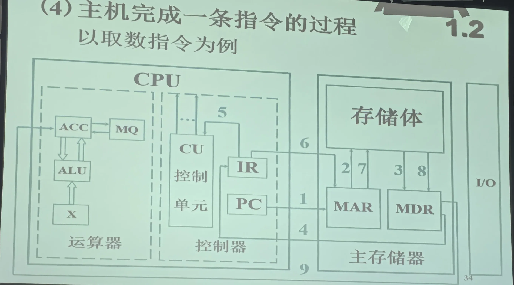
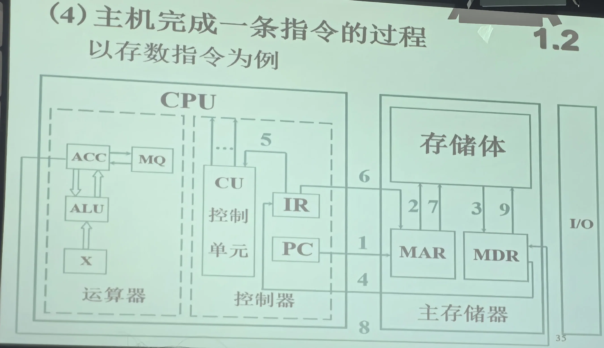

> [!abstract] 阅读方式
> 先用存储程序模型理解“程序怎样驱动硬件”，再沿寄存器传送过程观察一条指令，最后把 ISA、操作系统、固件与微架构放进同一张分层图。本文建立坐标系，不替代后续的数据表示、存储层级和操作系统专题。

> [!summary] 核心摘要
>
> 程序以指令和数据的形式存放在可寻址存储中，处理器通过取指、译码、执行和提交状态变化推进计算。ISA 规定软件可见的指令、寄存器和异常语义，微架构用流水线、缓存、乱序执行等机制实现 ISA；操作系统和固件在不同阶段管理与抽象硬件资源。

# 存储程序模型与系统部件

## 计算机在做什么

通用计算机不断执行三类动作：读取状态、按规则变换状态、把结果写回。这里的“状态”包括寄存器、内存、设备寄存器、文件和网络数据；高级语言最终必须落到处理器可执行的指令以及操作系统提供的服务。

经典的**存储程序模型（stored-program model）**包含两条关键原则：

1. 指令和数据都能编码为位串，并存放在可寻址存储系统中。
2. 处理器维护下一条指令的位置，按控制流取指并改变体系结构状态。

“指令和数据都是位串”不等于两者在任何时刻都没有区别。某段位模式被当作指令还是数据，取决于访问路径、地址权限、当前控制流和 ISA 的解释规则；同一页内存也可能在 JIT 等场景中先写入数据、同步后再作为代码执行。

## 五类逻辑部件

```text
				    ┌─────────────────────┐
				    │    Control Unit     │
				    └──────────┬──────────┘
							   │ control
		  ┌────────────────────┼────────────────────┐
		  │                    │                    │
		  ▼                    ▼                    ▼
  ┌──────────────┐     ┌───────────────┐     ┌───────────────┐
  │ Input / I-O  │◄───►│  Main Memory  │◄───►│ Output / I-O  │
  └──────────────┘     └───────┬───────┘     └───────────────┘
							   │ data
							   ▼
					    ┌──────────────┐
					    │  ALU / Exec  │
					    └──────────────┘
```

| 逻辑部件 | 主要职责 | 现代实现中的对应物 |
| --- | --- | --- |
| Control Unit（控制器） | 解释指令并协调数据通路 | 前端、译码器、调度器、提交单元等 |
| ALU / Execution Units（执行单元） | 整数、浮点、向量、地址计算和分支 | ALU、FPU、SIMD、load/store unit |
| Memory（存储） | 保存代码与数据 | 寄存器、缓存、DRAM、持久存储组成的层级 |
| Input（输入） | 将外界事件或数据带入系统 | 键盘、网卡、磁盘、传感器及其控制器 |
| Output（输出） | 将计算结果送往外界 | 显示、网络、存储和其他设备 |

这是**逻辑分类**，不是现代芯片的物理布线图。例如输入和输出通常都经由统一的 I/O 子系统、总线或片上互连访问内存与 CPU。

# 指令周期与数据通路

## 教学模型中的取指过程

以下寄存器名来自经典单总线/累加器教学模型：

| 寄存器 | 英文 | 作用 |
| --- | --- | --- |
| PC | Program Counter | 保存下一条待取指令的地址 |
| MAR | Memory Address Register | 保存本次存储访问的地址 |
| MDR | Memory Data Register | 暂存从内存读出或准备写入内存的数据 |
| IR | Instruction Register | 保存当前正在译码或执行的指令 |
| ACC | Accumulator | 教学机中的通用运算累加器 |

一条顺序指令的概念性取指过程可以写成寄存器传送语义（register-transfer notation）：

```text
MAR ← PC
MDR ← Memory[MAR]
IR  ← MDR
PC  ← next sequential address
decode(IR)
```

`next sequential address` 不应机械理解为固定的 `PC + 1`：指令可能是变长编码，分支、异常、中断和预测结果也会改变控制流。现代处理器还会一次取多条指令、提前预测分支并并行执行；上面的步骤用于理解**架构语义**，不是逐周期时序承诺。

## 装入类指令：内存到寄存器

> [!important] 图片范围
> 下图是课程中的传统累加器模型。图中 1～9 的编号应以原课程讲义定义为准；本文用稳定的微操作语义解释数据方向，不把编号硬套到不同教材的节拍命名上。

**图 1：取数/装入类指令的数据通路**



取指完成并得到有效地址 `EA` 后，装入类指令的核心数据流是：

```text
MAR ← EA
MDR ← Memory[MAR]
ACC ← MDR                 # 现代 ISA 中通常是目标通用寄存器
```

这里要区分两次可能的内存读取：第一次读取**指令本身**，第二次读取指令指定的**操作数**。如果操作数已在缓存中，物理实现不必访问 DRAM，但 ISA 可见结果不变。

## 存储类指令：寄存器到内存

**图 2：存数/存储类指令的数据通路**



存储类指令在得到有效地址后反向传递数据：

```text
MAR         ← EA
MDR         ← ACC         # 现代 ISA 中通常来自某个源寄存器
Memory[MAR] ← MDR
```

真实处理器常把 store 先放入 store buffer，再按内存一致性和缓存一致性规则对其他观察者可见。因此“指令执行结束”和“写入已经到达 DRAM”不是同一个事件。

## 不止取指、译码、执行

后端学习至少要意识到以下边界：

- **分支**修改下一条指令地址，预测错误会导致错误路径上的工作被丢弃。
- **异常和中断**保存必要状态并把控制权转交给特权软件。
- **内存访问**可能遇到缓存未命中、地址转换、权限检查或缺页。
- **乱序执行**允许内部完成顺序不同，但处理器必须维持 ISA 和内存模型要求的可见行为。

# ISA 与现代处理器实现

## 架构契约和微架构

**指令集架构（Instruction Set Architecture, ISA）**是机器级软件与处理器之间的契约，通常规定：

- 指令编码与语义；
- 软件可见寄存器和地址空间；
- 特权级、异常和中断行为；
- 原子操作与内存顺序的架构保证。

**微架构（microarchitecture）**决定如何实现同一 ISA。不同处理器可以执行相同的 x86-64、Arm A-profile 或 RISC-V 程序，却具有不同的流水线宽度、缓存容量、执行端口和功耗特征。

| 实现机制 | 解决的问题 | 不改变的边界 |
| --- | --- | --- |
| Pipeline（流水线） | 让多条指令处于不同处理阶段 | ISA 定义的指令结果 |
| Superscalar（超标量） | 每周期发射或执行多条指令 | 单线程可观察语义 |
| Out-of-order execution（乱序执行） | 隐藏数据依赖和访存延迟 | 提交时满足架构顺序约束 |
| Branch prediction（分支预测） | 减少等待真实控制流的停顿 | 预测错误不能成为架构结果 |
| Cache hierarchy（缓存层级） | 缓解处理器与主存的延迟/带宽差 | 一致性与内存模型要求 |

## 冯·诺依曼与 Harvard 标签的边界

纯 Harvard 机器把指令存储和数据存储分开；许多现代通用处理器拥有分离的 L1 instruction cache 与 data cache，同时共享更低层缓存和统一地址空间，常被称为 **modified Harvard**。这个标签只能描述部分取指/访存组织，不能概括整台现代计算机。

所谓“冯·诺依曼瓶颈”也不只是 CPU 与 DRAM 的速度差：延迟、带宽、局部性、缓存未命中、数据依赖以及并行度不足都可能成为限制。工程上必须测量，不能仅凭架构标签判断瓶颈。

## 自修改代码并非简单禁止

现代系统通常不鼓励普通业务程序修改正在执行的代码，操作系统也常用 W^X（页面不可同时可写和可执行）降低攻击面；但 JIT 编译器、动态链接器、内核补丁和调试/插桩工具仍会生成或修改代码。

- x86 支持自修改与跨核修改代码，但要求遵循序列化规则，而且可能产生较大流水线代价。
- Arm 上写入代码后通常需要清理数据缓存、使指令缓存失效并执行必要屏障。
- “可实现”不等于“适合业务代码”；应优先使用运行时和操作系统提供的安全抽象。

# 软件、操作系统与固件的边界

## 从源代码到硬件

```text
Source code / configuration
            │ compiler, interpreter, runtime
            ▼
Application + libraries
            │ API / ABI / system calls
            ▼
Operating system kernel
            │ privileged ISA, MMU, interrupts, device interface
            ▼
Instruction Set Architecture (ISA)
            │ implemented by
            ▼
Microarchitecture: pipeline, cache, execution units
            │ built from
            ▼
Digital circuits and physical devices
```

抽象的价值是隔离变化和控制复杂度；代价是额外开销、信息隐藏和**抽象泄漏（leaky abstraction）**。系统编程不是绕过所有抽象，而是在性能、可靠性或排障需要时知道应该下探到哪一层。

## 操作系统提供的三类核心能力

| 能力 | 例子 |
| --- | --- |
| 抽象 | 进程、虚拟内存、文件、socket |
| 复用与调度 | CPU 时间片、内存页、I/O 队列 |
| 隔离与保护 | 地址空间、权限、用户态/内核态、安全边界 |

## 固件不是固定的一层“夹心”

固件（firmware）也是由处理器执行的软件。平台启动时，固件初始化硬件并选择、装载 OS loader；操作系统接管后，大多数启动服务结束，但少量运行时服务可能继续存在。

- Legacy BIOS 是传统 x86 启动接口，不宜再概括所有现代机器。
- UEFI 定义 OS 与平台固件之间的接口、启动服务和运行时服务；OS loader 调用 `ExitBootServices()` 后，启动阶段的资源管理责任转交给操作系统。
- 设备内部也可能有独立固件，例如网卡、SSD、GPU 和管理控制器固件。

因此，固件与操作系统都运行在 ISA 之上；固件主要按**生命周期与职责**区分，而不是物理上位于 ISA 与硬件之间的一条固定层。

# 实验与掌握标准

## 最小观察实验

在 Linux/WSL 中准备一个只有加法与函数调用的 C++ 程序，然后观察不同层的产物：

```bash
g++ -O0 -g demo.cpp -o demo
file demo
readelf -h demo
objdump -d -Mintel demo | less
strace -o trace.txt ./demo
```

执行后回答：

1. 源代码中的函数、变量和循环分别在反汇编中留下了什么痕迹？
2. 哪些行为由 CPU 指令完成，哪些必须通过系统调用请求内核？
3. `-O0` 改成 `-O2` 后，哪些指令消失或重排？为什么语义仍应保持？
4. 图中的 MAR/MDR 是教学可见寄存器；为什么在真实 x86-64 汇编中找不到同名寄存器？

> [!warning] 常见误区
> - 把五大部件当作现代芯片的物理模块图，而忽略缓存、MMU、片上互连与设备控制器。
> - 把 ISA 和微架构混为一谈，例如用“x86 一定有某种缓存大小”描述架构保证。
> - 认为指令执行完成就意味着数据已经写入 DRAM。
> - 认为高级语言语句与机器指令一一对应，忽略编译优化、运行时和系统调用。

# 资料与后续

本文的现代实现边界核对自 Intel 64/IA-32 手册入口、Arm 关于指令/数据缓存同步的官方说明，以及 UEFI 2.11 规范。版本化实现细节应继续以厂商手册为准。

- [Intel 64 and IA-32 Architectures Software Developer's Manuals](https://www.intel.com/content/www/us/en/developer/articles/technical/intel-sdm.html)
- [Arm: Caches and Self-Modifying Code](https://developer.arm.com/community/arm-community-blogs/b/architectures-and-processors-blog/posts/caches-self-modifying-code-implementing-clear-cache)
- [UEFI Specification 2.11](https://uefi.org/specs/UEFI/2.11/)
- 下一步：[Data Representation (数据表示)](/01-Foundations%20(基础能力)/01-CS%20Core%20(计算机核心)/02-Data%20Representation%20(数据表示).md)
