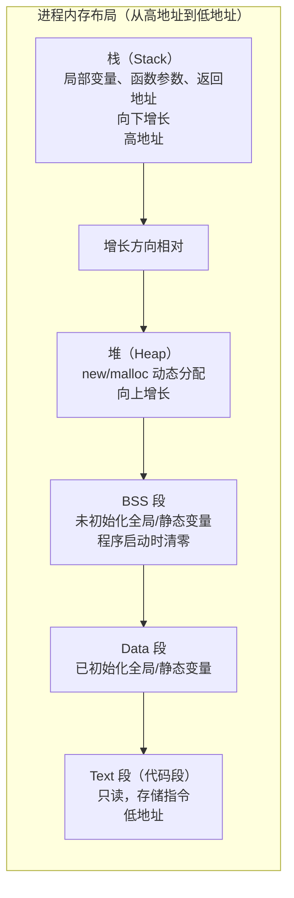

---
tags:
  - cpp
  - core-mechanism
  - memory-layout
status: 🌱
---

> [!important] **核心考点**
> 进程内存四区的划分与作用、堆与栈的区别、BSS/data/text 各自存放什么



```cpp
int   g_init   = 42;          // Data 段（已初始化全局变量）
int   g_uninit;               // BSS 段（未初始化全局变量，自动清零）
static int s_var = 10;        // Data 段

void foo() {
    int local = 1;            // 栈（函数返回时自动释放）
    static int s = 0;         // Data/BSS 段（static 局部变量，只初始化一次）
    int* p = new int(2);      // 堆（需要手动 delete，或用智能指针）
}
// 指令本身在 Text 段
```

### 栈 vs 堆

| |栈|堆|
|---|---|---|
|分配方式|自动（移动 SP）|手动（new/malloc）|
|速度|极快（O(1)）|较慢（需找空闲块）|
|大小|有限（默认 8MB）|受虚拟内存限制|
|生命周期|作用域结束自动释放|手动管理（或智能指针）|
|碎片|无|有（长时间运行后）|

---

内存布局相关概念详见 → [Memory Alignment (内存对齐)](/03-C++%20Programming%20(编程语言)/02%20·%20核心机制/04-Memory%20Model%20&%20Layout%20(内存模型与布局)%20⭐/04b-Memory%20Alignment%20(内存对齐).md) · [Memory Pool Implementation (内存池实现)](/03-C++%20Programming%20(编程语言)/02%20·%20核心机制/04-Memory%20Model%20&%20Layout%20(内存模型与布局)%20⭐/04c-Memory%20Pool%20Implementation%20(内存池实现).md)
