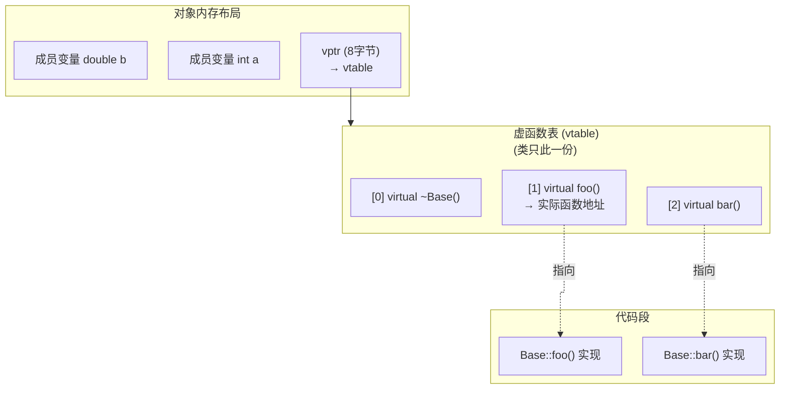

---
tags:
  - cpp/core
status: 🌱
---

> [!important] **核心考点**：虚函数表结构、vptr 指针、单继承下的 VTable 布局

## 虚函数表（VTable）

每个含虚函数的**类**有一个 VTable（虚函数表），表中存放虚函数指针。每个**对象**有一个隐藏的 `vptr`（虚指针），指向其类的 VTable。



```cpp
class Base {
public:
    virtual void foo() { std::cout << "Base::foo\n"; }
    virtual void bar() { std::cout << "Base::bar\n"; }
    virtual ~Base() = default;
};

class Derived : public Base {
public:
    void foo() override { std::cout << "Derived::foo\n"; }
    // bar() 未覆盖，VTable 中 bar 项指向 Base::bar
};

// vptr 的开销：每个对象多 8 字节（64位），每个类多一个静态 VTable
sizeof(Base);     // 8（只有 vptr）
sizeof(Derived);  // 8（继承 vptr，无额外数据成员）
```

## 虚函数调用流程

```
Base* p = new Derived();
p->foo();
// 汇编等价：
// 1. 从 p 读出 vptr（p 的前 8 字节）
// 2. 从 vptr[0] 读出 foo 的地址
// 3. 间接调用
// 代价：一次额外内存读取 + 不可内联
```

## override & final（C++11）

```cpp
class Base {
    virtual void foo(int);
    virtual void bar();
};

class Derived : public Base {
    void foo(int) override;   // 编译器检查：基类确实有此虚函数签名
    void foo(double) override; // 编译错误！基类没有 foo(double)，防止笔误
    void bar() final;          // 禁止子类再覆盖 bar
};

class Leaf final : public Derived { };  // 禁止继承 Leaf
```

---

多态与动态分发详见 → [Polymorphism & Dynamic Dispatch (多态与动态分发)](/03-C++%20Programming%20(编程语言)/02%20·%20核心机制/07-Object%20Model%20&%20VTable%20(对象模型与虚表)%20⭐/07b-Polymorphism%20&%20Dynamic%20Dispatch%20(多态与动态分发).md) · [Abstract Class & Pure Virtual (抽象类)](/03-C++%20Programming%20(编程语言)/02%20·%20核心机制/07-Object%20Model%20&%20VTable%20(对象模型与虚表)%20⭐/07c-Abstract%20Class%20&%20Pure%20Virtual%20(抽象类).md)
