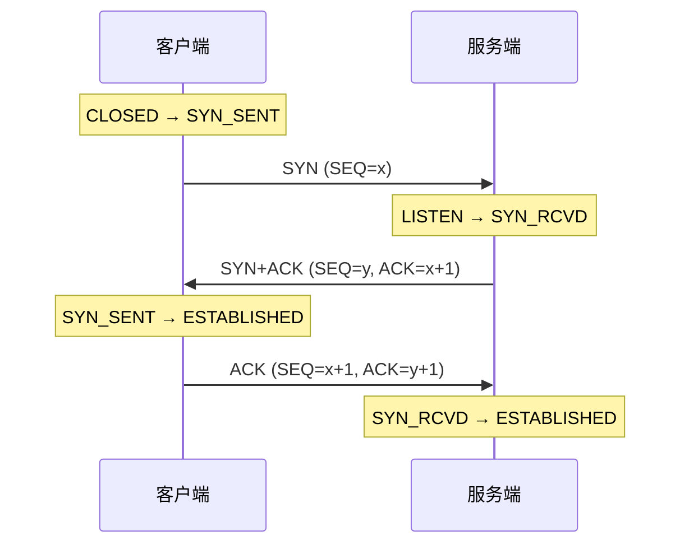
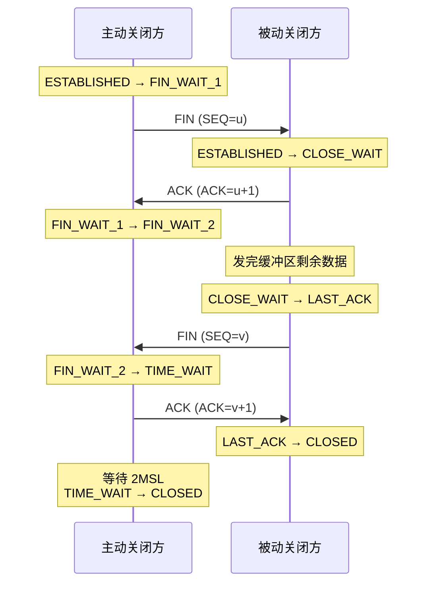

---
tags:
  - network
  - networking
status: 🌱
---

> [!important] **核心考点**
> 为什么是三次/四次、每步状态变化、异常场景

# 三次握手（建立连接）

TCP 连接建立需要三次报文交换，目的是**双方互相确认对方的发送和接收能力都正常**。

## 为什么必须三次，不能两次？

两次握手无法解决**历史连接的干扰**问题：

- 若网络中有一个旧的 SYN 延迟到达服务端，服务端回 SYN+ACK 就认为连接建立成功
- 但客户端知道这不是自己发的，会无视，服务端却一直等待，浪费资源
- 三次握手让客户端有机会拒绝历史连接（不发第三次 ACK）

> **本质：用三次握手同步双方的初始序列号（ISN），并排除旧连接干扰**

## 为什么不需要四次？

服务端可以把 SYN 和 ACK 合并成一个报文同时发送，没有必要分两次。

---

# 四次挥手（断开连接）

TCP 是**全双工**的，双方各自独立关闭自己的发送方向，所以需要四次。

## 为什么需要四次，不能三次？

- 收到 FIN 只表示对方**不再发数据**，但对方还可以继续接收
- 被动关闭方可能还有数据没发完，ACK 和 FIN 不能合并
- 必须等被动方数据发完，才能发 FIN

## TIME_WAIT 为什么等 2MSL？

- **MSL**：报文在网络中的最大存活时间，通常 60s
- 等待 2MSL 的两个原因：
    1. **确保最后一个 ACK 能到达对端**：若对端没收到最后的 ACK，会重发 FIN，2MSL 足够接收重传并再次 ACK
    2. **让旧连接的所有报文在网络中消失**：防止新连接收到旧连接的延迟报文

---

## 常见异常场景

|场景|发生什么|
|---|---|
|第三次握手丢失|服务端超时重传 SYN+ACK，客户端再次 ACK|
|服务端没有 LISTEN|服务端回 RST，连接被重置|
|同时打开|双方同时发 SYN，各自进入 SYN_SENT → SYN_RCVD，最终 ESTABLISHED|
|同时关闭|双方同时发 FIN，各自进入 CLOSING 状态，最终都进入 TIME_WAIT|

---

## 关联笔记

- [TCP State Machine (状态机全图)](/05-Network%20Programming%20(网络编程)/01%20·%20网络基础/02-TCP%20Deep%20Dive%20(TCP深入)%20⭐/02b-TCP%20State%20Machine%20(状态机全图).md)
- [TIME_WAIT：Why & How to Handle (TIME_WAIT原因与处理)](/05-Network%20Programming%20(网络编程)/01%20·%20网络基础/02-TCP%20Deep%20Dive%20(TCP深入)%20⭐/02c-TIME_WAIT：Why%20&%20How%20to%20Handle%20(TIME_WAIT原因与处理).md)
- [Flow Control & Congestion Control (流量控制与拥塞控制)](/05-Network%20Programming%20(网络编程)/01%20·%20网络基础/02-TCP%20Deep%20Dive%20(TCP深入)%20⭐/02d-Flow%20Control%20&%20Congestion%20Control%20(流量控制与拥塞控制).md)
- [Sticky Packet Problem & Solutions (粘包问题与解决)](/05-Network%20Programming%20(网络编程)/01%20·%20网络基础/02-TCP%20Deep%20Dive%20(TCP深入)%20⭐/02e-Sticky%20Packet%20Problem%20&%20Solutions%20(粘包问题与解决).md)
- [TCP⧸IP Stack Overview (协议栈总览)](/05-Network%20Programming%20(网络编程)/01%20·%20网络基础/01-TCP⧸IP%20Stack%20Overview%20(协议栈总览).md)
