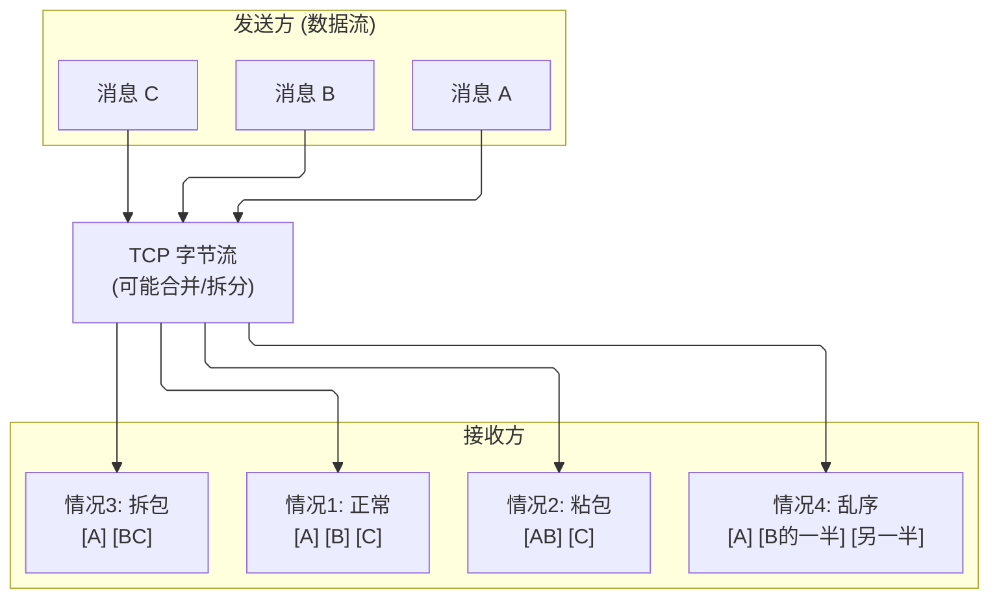

---
tags:
  - network/core
status: 🌱
---

> [!important] **核心考点**：什么是粘包、根本原因、四种解决方案

## 什么是粘包？

**粘包（Sticky Packet）**：接收方在读取数据时，无法正确区分出原始的消息边界，多个消息被"粘"在一起，或一个消息被拆成多段读取。



---

## 根本原因

### 1. TCP 是字节流协议

TCP **不保留消息边界**，只保证字节的顺序和可靠性。发送的 "消息" 概念在 TCP 层是不存在的，只有连续的字节流。

### 2. Nagle 算法

为减少小包发送，Nagle 算法会将多个小数据合并成一个 TCP 段再发送：

- 条件：有未确认的数据 && 待发数据 < MSS → 等待，累积后再发
- 结果：多个应用层 write() 的数据可能被合并成一个 TCP 段

### 3. 接收缓冲区读取时机

- 接收方没有及时读取，缓冲区积压了多条消息
- 应用层一次 read() 可能读出多条消息的数据

> **注意：粘包是应用层问题，不是 TCP 的 bug。** TCP 本就是字节流，正确的应用层协议设计需要自己定义消息边界。

---

## 四种解决方案

### 方案一：固定长度消息

每条消息长度固定，接收方每次读取固定字节数。

```
发送：[MSG_001____][MSG_002____]（每条固定 10 字节）
接收：每次 read(10 bytes) 即为一条完整消息
```

- ✅ 实现简单
- ❌ 消息长度不灵活，短消息浪费空间

### 方案二：特殊分隔符

用特定字符标记消息结尾（如 `\n`、`\r\n`、`\0`）。

```
发送：Hello\nWorld\n
接收：按 \n 分割，还原两条消息
```

- ✅ 实现简单，适合文本协议（HTTP/1.x、Redis RESP）
- ❌ 消息内容中不能含有分隔符（或需转义）

### 方案三：消息头 + 长度字段（最常用）

在消息前加固定长度的头部，头部中包含消息体的长度。

```
┌─────────────────┬───────────────────────┐
│  Header (4字节) │   Body (N字节)        │
│  length = N     │  实际消息内容         │
└─────────────────┴───────────────────────┘

接收流程：
1. 先读 4 字节，解析出 N
2. 再读 N 字节，得到完整消息体
```

- ✅ 灵活、高效，适合二进制协议
- ✅ 工业界主流方案（Dubbo、gRPC、Kafka 等都用这种）
- ❌ 需要处理拆包逻辑（一次 read() 可能只读到部分头部）

### 方案四：应用层自定义完整协议（TLV）

TLV（Type-Length-Value）结构：

```
┌─────────┬─────────┬──────────────┐
│  Type   │ Length  │    Value      │
│ (2字节) │ (4字节) │  (Length字节) │
└─────────┴─────────┴──────────────┘
```

- ✅ 扩展性强，支持多种消息类型
- ✅ 适合复杂协议（MQTT、自定义 RPC 框架）

---

## 禁用 Nagle 算法

对于**低延迟场景**（如游戏、实时通信），可以禁用 Nagle 算法，让小包立即发送：

```cpp
int flag = 1;
setsockopt(fd, IPPROTO_TCP, TCP_NODELAY, &flag, sizeof(flag));
```

- 减少合包延迟，但会增加网络中小包数量
- 适合：SSH 交互、游戏操作同步、低延迟 RPC

---

## 粘包处理的代码模式（C++ 实现）

```cpp
// 读取完整消息（方案三：头部 + 长度字段）
// 返回 0 成功，-1 连接关闭/出错
int readMessage(int fd, vector<char>& out) {
    // 1. 读取 4 字节头部，获取消息长度
    uint32_t netLen;
    ssize_t n = read(fd, &netLen, sizeof(netLen));
    if (n <= 0) return -1;                         // 关闭或错误
    size_t remain = sizeof(netLen) - (size_t)n;
    while (remain > 0) {                           // 处理拆包：头部可能没读完
        n = read(fd, (char*)&netLen + sizeof(netLen) - remain, remain);
        if (n <= 0) return -1;
        remain -= (size_t)n;
    }
    uint32_t bodyLen = ntohl(netLen);              // 网络字节序转主机字节序

    // 2. 按长度读取消息体
    out.resize(bodyLen);
    remain = bodyLen;
    char* ptr = out.data();
    while (remain > 0) {
        n = read(fd, ptr, remain);
        if (n <= 0) return -1;
        ptr += n;
        remain -= (size_t)n;
    }
    return 0;
}

// 发送消息（长度头部 + 消息体）
void sendMessage(int fd, const char* data, uint32_t len) {
    uint32_t netLen = htonl(len);                  // 主机转网络字节序
    vector<iovec> iov(2);
    iov[0] = {&netLen, sizeof(netLen)};
    iov[1] = {(void*)data, len};
    writev(fd, iov.data(), (int)iov.size());        // 聚集写，减少系统调用
}
```

> **关键点：** C++ 中 `read()` 不保证一次读满指定字节数（拆包），必须循环读取直到收满。`writev` 聚集写避免多次 syscall。网络字节序用 `htonl`/`ntohl` 转换，保证跨平台兼容。

---

## 总结对比

|方案|适用场景|优点|缺点|
|---|---|---|---|
|固定长度|消息格式固定的内部协议|最简单|不灵活|
|分隔符|文本协议（HTTP、Redis）|简单易读|内容受限|
|长度头部|通用二进制协议（主流）|灵活高效|需处理拆包|
|TLV|复杂协议（MQTT、RPC）|扩展性强|实现复杂|

---

粘包与 TCP 流式传输机制详解见 → [Flow Control & Congestion Control (流量控制与拥塞控制)](</05-Network%20Programming%20(网络编程)/01%20·%20网络基础/02-TCP%20Deep%20Dive%20(TCP深入)%20⭐/02d-Flow%20Control%20&%20Congestion%20Control%20(流量控制与拥塞控制).md>) · [TCP State Machine (状态机全图)](</05-Network%20Programming%20(网络编程)/01%20·%20网络基础/02-TCP%20Deep%20Dive%20(TCP深入)%20⭐/02b-TCP%20State%20Machine%20(状态机全图).md>)
