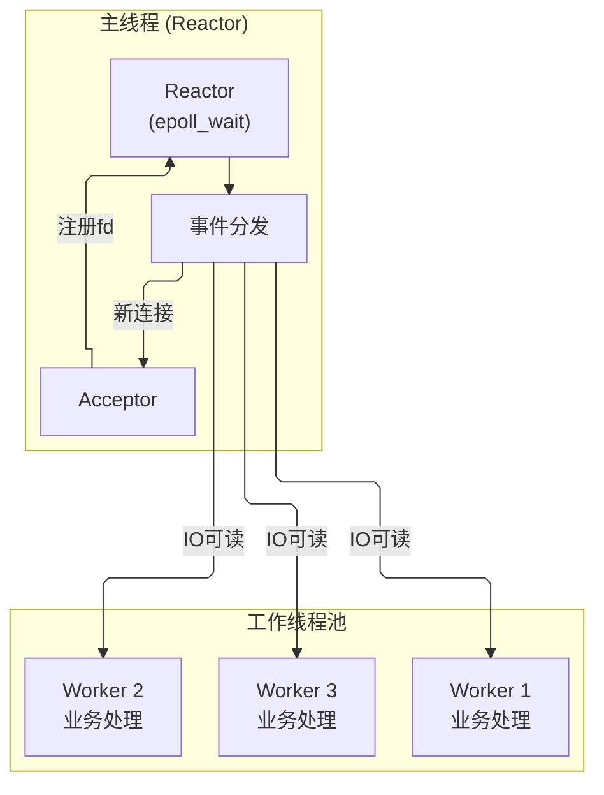

---
tags:
  - network/socket
status: 🌱
---

> [!important] **核心考点**
> 单 Reactor 多线程模型、IO 线程与工作线程分离、任务队列与线程安全
> 解决了单线程模型"业务处理阻塞"的问题

## 模型结构



## 核心代码结构

```cpp
// 主线程 Reactor + 工作线程池（简化）
class ThreadPool {
    std::vector<std::thread> workers_;
    std::queue<Task> tasks_;
    std::mutex mtx_;
    std::condition_variable cv_;
    bool stop_ = false;

public:
    ThreadPool(int n) {
        for (int i = 0; i < n; i++)
            workers_.emplace_back([this] {
                while (true) {
                    Task t;
                    {
                        std::unique_lock lock(mtx_);
                        cv_.wait(lock, [this] { return stop_ || !tasks_.empty(); });
                        if (stop_ && tasks_.empty()) return;
                        t = std::move(tasks_.front()); tasks_.pop();
                    }
                    t();  // 工作线程执行业务逻辑
                }
            });
    }
    void submit(Task t) {
        std::lock_guard lock(mtx_);
        tasks_.push(std::move(t));
        cv_.notify_one();
    }
};

// 使用方式：Handler 中收到读事件后
void Handler::on_readable() {
    char buf[4096]; int n = read(fd_, buf, sizeof(buf));
    // 将业务处理提交到线程池，不阻塞主线程
    thread_pool_.submit([this, data = std::string(buf, n)] {
        std::string resp = process(data);  // 业务处理（在 worker 线程）
        // 注意：write 需要回到主线程或加锁保护 fd
        write(fd_, resp.data(), resp.size());
    });
}
```

## 工作流程

1. 主线程 Reactor 监听事件，Acceptor 接受新连接
2. 读事件到来，Handler 在**主线程**完成 `read()`，将数据投递给线程池
3. 工作线程处理业务逻辑
4. 处理完成后写回响应

## 优点

- 业务处理与 I/O 解耦，业务耗时不影响 I/O 响应
- 能利用多核 CPU

## 缺点

- **单 Reactor 仍是瓶颈**：所有 I/O 事件都在一个线程处理
- 工作线程写回时需要注意线程安全（共享的 fd → 加锁或排队写）

> **与 05a 的区别：** 05a 所有工作在单线程串行；05b 将业务逻辑卸载到工作线程，I/O 读写仍在主线程。高并发下主线程仍可能成为瓶颈——进一步优化见 05c 主从 Reactor 模型。

---

Reactor 模型演进见 → [Single Reactor Single Thread (单reactor单线程)](</05-Network%20Programming%20(网络编程)/02%20·%20Socket编程/05-Reactor%20&%20Proactor%20Pattern%20(事件驱动模型)%20⭐/05a-Single%20Reactor%20Single%20Thread%20(单reactor单线程).md>) · [Multi Reactor Multi Thread： one loop per thread (主从reactor)](</05-Network%20Programming%20(网络编程)/02%20·%20Socket编程/05-Reactor%20&%20Proactor%20Pattern%20(事件驱动模型)%20⭐/05c-Multi%20Reactor%20Multi%20Thread：%20one%20loop%20per%20thread%20(主从reactor).md>)
