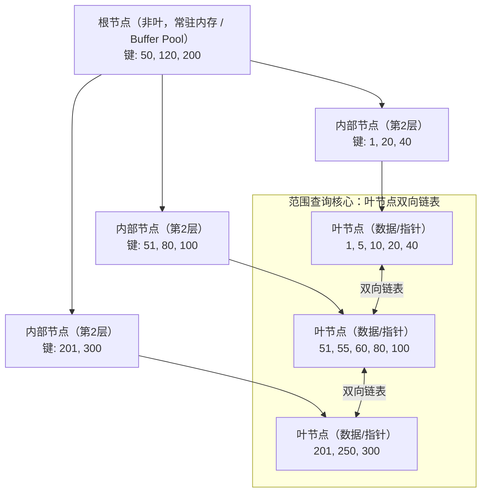

---
tags:
  - database
  - innodb
status: 🌱
---

> [!important] **核心考点**
> B+ 树索引结构（非叶节点存储键+指针、叶节点存储记录+双向链表）、高度与 IO 次数

## B+ 树 vs B 树

| 特性 | B 树 | B+ 树 |
|------|------|-------|
| 非叶节点 | 存储键 + 值（数据） | **仅存储键 + 指针** |
| 叶节点 | 存储键 + 值 | 存储键 + 数据（或指向数据的指针） |
| 叶节点连接 | 无 | **双向链表**（范围查询优势） |
| 数据查找 | 可能在非叶节点找到 | 必须走到叶节点 |
| 范围查询 | 中序遍历 | 链表遍历 O(k) |

**B+ 树的核心优势：** 非叶节点不存储数据 → 每页能存更多键 → 树更矮 → IO 更少。

## B+ 树结构详解



## 树的高度与 IO 次数

InnoDB 每页 16KB，假设：
- 主键 BIGINT（8 字节） + 指针（6 字节） = 14 字节/键值
- 每页可存储: 16384 / 14 ≈ 1170 个键值

```
行数估算：
  高度 1（根节点直接存储数据）→ 1170 行（实际 1-2 页）
  高度 2（根 → 叶）         → 1170 × 1170 ≈ 137 万行
  高度 3（根 → 内部 → 叶）  → 1170^3 ≈ 16 亿行
  高度 4                     → 1170^4 ≈ 1.8 万亿行

查找任意记录：
  高度 3 的树 → 3 次 IO（根节点常驻 Buffer Pool → 实际 2 次 IO）
  高度 4 的树 → 4 次 IO
```

**实际测试数据：**
```
500 万行数据 → B+ 树高度通常为 3
5000 万行数据 → B+ 树高度通常为 3-4
5 亿行数据 → B+ 树高度通常为 4
```

**B+ 树扇出（fan-out）对性能的影响：**
```
每页键值数（扇出）越大 → 树越矮 → IO 越少

优化列：选择小数据类型做主键（INT 4 字节 < BIGINT 8 字节 < VARCHAR）
  键越短 → 每页存更多键值 → 树更矮
```

## 页分裂与合并

当插入导致页满时发生页分裂：

```
原页 [10, 20, 30, 40, 50] 满
插入 25

分裂后：
  左页 [10, 20]  右页 [25, 30, 40, 50]
  父节点增加键 25 指向右页
```

**页分裂成本高：** 涉及数据移动 + 父节点更新。顺序插入（自增主键）只在最右叶节点分裂，减少重平衡开销。

> [!tip]- **工程要点**
> B+ 树的高度决定了索引查找所需的 IO 次数。对于千万级表，3 层 B+ 树只需 2-3 次 IO 即可找到数据，这是关系数据库高效的核心原因。使用自增主键 + 较短的数据类型（INT 优于 BIGINT 优于 VARCHAR）可以最大化扇出，最小化树高。

---

## 关联笔记

- [Page Structure & Buffer Pool (页结构与缓冲池)](/06-Database%20(MySQL)/02%20·%20INNODB存储引擎/04-InnoDB%20Storage%20Engine%20(InnoDB存储引擎)%20⭐/04a-Page%20Structure%20&%20Buffer%20Pool%20(页结构与缓冲池).md)
- [Clustered vs Secondary Index (聚簇索引与二级索引)](/06-Database%20(MySQL)/02%20·%20INNODB存储引擎/04-InnoDB%20Storage%20Engine%20(InnoDB存储引擎)%20⭐/04c-Clustered%20vs%20Secondary%20Index%20(聚簇索引与二级索引).md)
- [Index Pushdown & Covering Index (索引下推与覆盖索引)](/06-Database%20(MySQL)/02%20·%20INNODB存储引擎/04-InnoDB%20Storage%20Engine%20(InnoDB存储引擎)%20⭐/04d-Index%20Pushdown%20&%20Covering%20Index%20(索引下推与覆盖索引).md)
- [DDL, DML, DQL (SQL基础语法)](/06-Database%20(MySQL)/01%20·%20SQL基础/01-DDL,%20DML,%20DQL%20(SQL基础语法).md)
- [Joins & Subqueries (多表查询与子查询)](/06-Database%20(MySQL)/01%20·%20SQL基础/02-Joins%20&%20Subqueries%20(多表查询与子查询).md)
