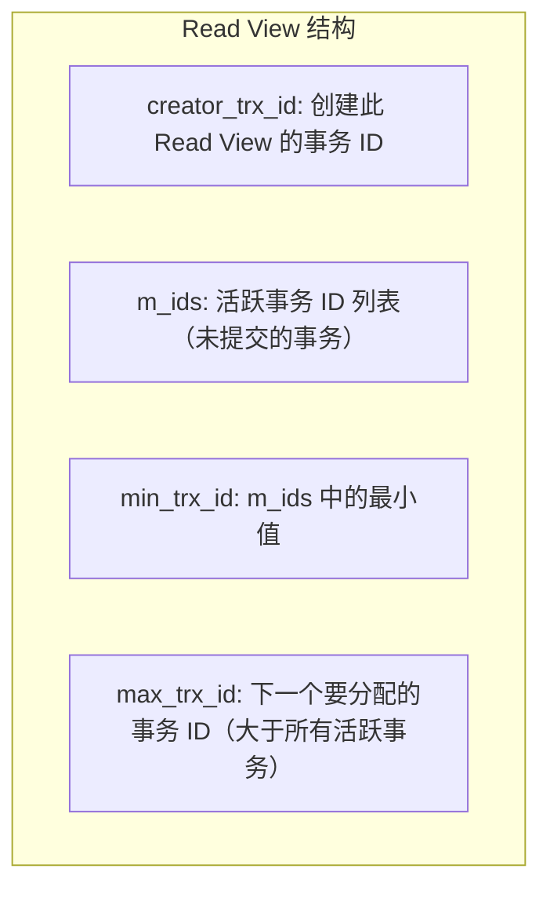
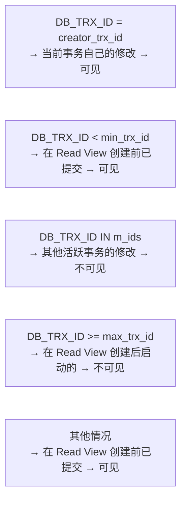
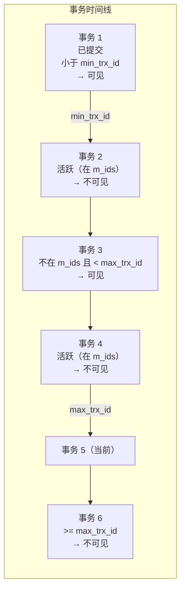

---
tags:
  - database
  - innodb
status: 🌱
---

> [!important] **核心考点**
> MVCC 通过 undo log 实现一致性读、Read View 可见性判断、快照读与当前读

## MVCC 核心思想

MVCC（Multi-Version Concurrency Control，多版本并发控制）允许**读不阻塞写，写不阻塞读**。

```
传统锁机制：
  事务 A 写行 1 → 行 1 被锁 → 事务 B 读行 1 → 等待

MVCC 机制：
  事务 A 写行 1 → 创建新版本（undo log 保留旧版本）
  事务 B 读行 1 → 读取快照版本（旧版本）→ 无需等待
```

## 三列隐藏字段

InnoDB 的每行记录有三个隐藏列：

```
行记录结构（隐藏列）：
  ┌────────────┬──────────┬──────────┐
  │ DB_TRX_ID  │ DB_ROLL_PTR │ DB_ROW_ID │
  ├────────────┼──────────┼──────────┤
  │ 最后修改的  │ 指向 undo │ 自增行 ID  │
  │ 事务 ID    │ log 纪录  │（无主键时） │
  └────────────┴──────────┴──────────┘
  └──────────────────────────────────────┘
  ┌──────────────────────────────────────┐
  │  实际业务列（col1, col2, ...）       │
  └──────────────────────────────────────┘

DB_TRX_ID：最近修改此行的事务 ID（递增）
DB_ROLL_PTR：指向回滚段中的 undo log 记录（可找到历史版本）
```

## undo log 版本链

每次 UPDATE 产生一条 undo log，通过 DB_ROLL_PTR 串联成版本链：


## Read View 可见性判断

Read View 是 MVCC 实现的核心——它定义了"哪些事务的修改对当前事务可见"。



**可见性判断规则（判断 DB_TRX_ID）：**



**图示（事务时间线与可见性）：**



## 快照读 vs 当前读

```sql
-- 快照读（Snapshot Read）：读 MVCC 历史版本，不加锁
SELECT * FROM t WHERE id = 1;
SELECT * FROM t WHERE id = 1 LOCK IN SHARE MODE;  -- 注意：这是当前读！

-- 当前读（Current Read）：读最新版本，加锁
SELECT * FROM t WHERE id = 1 FOR UPDATE;           -- 排他锁
SELECT * FROM t WHERE id = 1 LOCK IN SHARE MODE;   -- 共享锁
UPDATE t SET val=10 WHERE id=1;                    -- 先当前读，再写
DELETE FROM t WHERE id=1;                          -- 先当前读，再删
INSERT INTO t VALUES(1, 10);                       -- 直接写
```

**Read View 的创建时机：**
```
RC（Read Committed）：
  每条语句执行前都创建新的 Read View
  → 同一事务内两次 SELECT 可能结果不同（不可重复读）

RR（Repeatable Read）：
  事务中第一个 SELECT 时创建 Read View，一直使用到事务结束
  → 同一事务内多次 SELECT 结果一致（可重复读）
```

## MVCC 实战场景

```
RR 级别下：
  事务 A: BEGIN;                      -- 创建 Read View
  事务 A: SELECT balance FROM account; -- 读取 Read View 时最新的已提交版本
  事务 B: UPDATE balance; COMMIT;      -- 修改并提交（新版本，但事务 A 的 Read View 不可见）
  事务 A: SELECT balance FROM account; -- 仍读到旧版本（RR 快照隔离）
  事务 A: COMMIT;                      -- Read View 释放
```

> [!tip]- **工程要点**
> MVCC 的核心优势是"读不阻塞写"——这在 OLTP 系统中极其重要。快照读是 MVCC 的主角，不加任何锁。而当前读（SELECT ... FOR UPDATE）不走 MVCC，直接读最新数据并加锁——这在高并发下容易成为瓶颈。在线业务中，尽量用快照读，只在"检测并更新"（如扣库存）的原子操作中使用当前读。

---

## 关联笔记

- [Isolation Levels：RU, RC, RR, Serializable (四种隔离级别)](/06-Database%20(MySQL)/02%20·%20INNODB存储引擎/05-Transaction%20&%20ACID%20(事务与ACID)%20⭐/05a-Isolation%20Levels：RU,%20RC,%20RR,%20Serializable%20(四种隔离级别).md)
- [Dirty Read, Non-repeatable Read, Phantom Read (三大并发问题)](/06-Database%20(MySQL)/02%20·%20INNODB存储引擎/05-Transaction%20&%20ACID%20(事务与ACID)%20⭐/05b-Dirty%20Read,%20Non-repeatable%20Read,%20Phantom%20Read%20(三大并发问题).md)
- [DDL, DML, DQL (SQL基础语法)](/06-Database%20(MySQL)/01%20·%20SQL基础/01-DDL,%20DML,%20DQL%20(SQL基础语法).md)
- [Joins & Subqueries (多表查询与子查询)](/06-Database%20(MySQL)/01%20·%20SQL基础/02-Joins%20&%20Subqueries%20(多表查询与子查询).md)
- [MySQL Basics (MySQL 基础)](/06-Database%20(MySQL)/01%20·%20SQL基础/02-MySQL%20Basics%20(MySQL%20基础).md)
