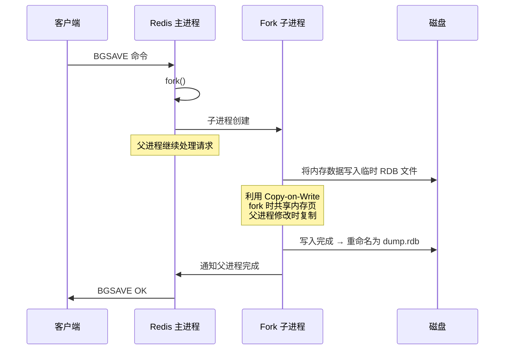

---
tags:
  - redis/core
status: 🌱
---

> [!important] **核心考点**
> RDB 触发方式、BGSAVE 写时复制（COW）、RDB 文件结构、优缺点

## RDB 快照

RDB 是 Redis 的全量快照持久化方式，将内存数据全部写入磁盘文件（`dump.rdb`）。

### 触发方式

```ini
# redis.conf 配置：
save 900 1           # 900 秒内至少 1 个 key 变化 → BGSAVE
save 300 10          # 300 秒内至少 10 个 key 变化 → BGSAVE
save 60  10000       # 60 秒内至少 10000 个 key 变化 → BGSAVE

# 手动触发：
# SAVE      → 主进程同步阻塞，不推荐
# BGSAVE    → fork 子进程异步写，推荐
# SHUTDOWN  → 自动执行 SAVE
```

### BGSAVE 写时复制（COW）



**COW 代价：** fork 后如果有大量写入，每个写操作的页（默认 4KB）都会触发复制，增加内存和延迟。`info persistence` 可监控 `rdb_changes_since_last_save`。

### RDB 文件结构

```
┌──────────┬──────────┬──────────┬──────────┬──────────┐
│ "REDIS"  │ RDB版本  │ 辅助字段 │ 数据库数据│ EOF标志  │
│ 0006     │ 5 字节   │   ...    │  key-val  │ 8 字节   │
└──────────┴──────────┴──────────┴──────────┴──────────┘
                      ↓
           ┌──────────────────────┐
           │ SELECTDB 0           │
           │  key-value 对        │
           │  类型编码 + key + 值 │
           │  EXPIRETIME 等       │
           └──────────────────────┘
```

---

## RDB 优缺点

| 优点 | 缺点 |
|------|------|
| 文件紧凑，适合备份和灾难恢复 | 丢数据风险大（两次快照间写入全丢） |
| 恢复速度远快于 AOF（直接加载） | BGSAVE fork 可能阻塞主进程 |
| 子进程写，主进程性能影响小（除 fork） | 大数据量时 fork 耗时可能达秒级 |
| 单个文件，数据迁移方便 | 频繁执行影响磁盘 I/O |

---

## 经典题型速查

| 题型 | 要点 |
|------|------|
| BGSAVE 为什么不阻塞 | fork 子进程读共享内存写入文件 |
| COW 对 Redis 的影响 | 写入量越大，子进程持有更多物理页，内存消耗可能翻倍 |
| SAVE 和 BGSAVE 的区别 | SAVE 主进程阻塞写；BGSAVE 子进程写 |
| RDB 适合什么场景 | 定时备份、灾备恢复、数据迁移 |
| RDB 丢多少数据 | 最多丢最后一次 BGSAVE 到宕机间的所有写操作 |

> [!tip]- **工程要点**
> RDB + AOF 混合使用是最佳实践（Redis 4.0+ 支持混合持久化 = AOF rewrite 时生成 RDB 段 + AOF 增量段）。`latency-monitor-threshold` 可用于监控 fork 阻塞。

---

AOF 日志与 RDB 快照对比详解见 → [01b2-AOF：Write-Ahead Log & Rewrite (日志重写)](/08-Distributed%20&%20Middleware%20(分布式与中间件)/01%20·%20Redis%20(缓存与数据结构)/01b-Persistence：RDB%20&%20AOF%20(持久化机制)%20⭐/01b2-AOF：Write-Ahead%20Log%20&%20Rewrite%20(日志重写).md)
