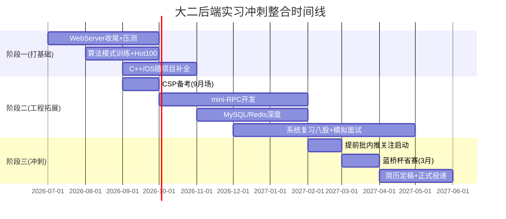

# 后端实习冲刺全系统规划

> [!important] 文档定位
> 这是一份**长期参照文档**，不是一次性读完就归档的笔记。建议每周复盘时打开它检查偏离情况，每月做一次内容修订。

## 目录
- [[#模块A 硬件与行为系统]]
- [[#模块B 学习方向校准]]
- [[#模块C 长期动力驱动]]
- [[#模块D 大厂实习冲刺]]
- [[#整合时间线]]
- [[#周度复盘模板]]

---

## 模块A 硬件与行为系统

> [!tip] 核心结论
> 三层设备分工：**主算力层**（笔记本）做重输出，**显示扩展层**（便携屏）做协同显示，**信息消费层**（手机/平板）做轻输入和复盘。重输出只用主力双屏，避免设备越多效率越低。

### A1 双屏部署
- 副屏置于左侧约45度角，而非正前方堆叠
- 屏幕分工：
  - 主屏 → CLion 全屏 + 终端
  - 副屏 → 笔记（左半）+ 浏览器/文档（右半），或日志/压测输出
- 供电：20000mAh 100W 充电宝实测可行，笔记本+便携屏走 USB-C 同线供电

### A2 三设备协同场景
| 时间段 | 设备 | 用途 |
|---|---|---|
| 通勤/碎片 | 手机 | 只读 LeetCode 题目描述、笔记 |
| 深度专注块 | 笔记本+便携屏双屏 | 写项目代码 / 刷题 |
| 晚间复盘 | 平板 | 轻量回顾当日新增笔记 |

> [!warning] 避坑
> 不同设备做不同事，每次切换都有上下文重建成本。

### A3 待办
- [ ] 踩点自习室插座密度/人流时段
- [ ] 确认背包能长期承重 3kg 左右

---

## 模块B 学习方向校准

> [!important] 核心调整
> 算法基础薄弱的真正问题是**没有按模式分类训练过**，不是没刷过题。直接冲 Hot100 容易刷完就忘。正确顺序：**先建模式词汇量 → 再冲 Hot100 → 间隔重复复盘**。

### B1 算法学习三步法
1. **2-3 周基础专题训练**，按数据结构/模式过一轮：数组→链表→哈希表→字符串→双指针→栈队列→二叉树→回溯→DP→贪心
2. **进入 LeetCode 热题 100**，此时刷题是验证模式识别能力，不是裸刷
3. **间隔重复复盘**：卡住的题标记，**3 天、7 天、14 天后**不看笔记重做

### B2 每日并行节奏
| 时间块 | 内容 |
|---|---|
| 上午深度块 2-3h | 项目主力开发 |
| 下午深度块 1.5-2h | 算法：1 道新题 + 1 道复盘题 |
| 晚间复盘 30-45min | 沉淀笔记 |

> [!warning] 纪律
> 算法每天不能断，项目再紧也至少做 1 道复盘题。

### B3 C++ 语言补全：跟着项目反查
- 不按《Effective Modern C++》章节顺序系统读
- 项目用到具体技术点 → 反查对应章节 → 在自己代码里验证

### B4 WebServer 范围控制
- [ ] 硬截止日期：______（建议大一暑假结束前）
- [ ] 必须产出：wrk 压测数据 + README + 能讲清楚设计取舍
- [ ] Redis 连接池等增量功能延后到阶段二，避免过度工程化

### B5 阶段验收标准
> 找一道**三周前**做过的中等题，不看任何笔记，限时 20 分钟独立写出来——能写出来才算真掌握。

---

## 模块C 长期动力驱动

> [!important] 核心认知
> 三个月高强度独自自学，崩溃不是会不会发生，是什么时候、以什么方式发生。提前识别崩溃点 > 临时打鸡血硬扛。

### C1 三个高风险时间点
- **第 2-3 周**：新鲜感褪去，进度变慢，容易怀疑方法、随意换路线 → 不是方法错，是动力来源切换的正常摩擦
- **第 6-8 周**：平台期+孤立感叠加，项目进入重复打磨期，容易产生无根据的焦虑
- **CSP/期末撞车周**：结构性资源冲突，提前降低这几周自学强度预期

### C2 补反馈闭环
- [ ] 建立周度仪表盘：每周记录硬指标（新做题数/复盘题数、commit 数、本周关键知识点）
- [ ] GitHub commit 历史当客观证据，动力低时回看三个月前的自己
- [ ] **每两周一次外部校准**：发技术社群/牛客网求反馈，防止方向跑偏

### C3 给系统加韧性
- [ ] 每周设 1 天"低强度日"（只做复盘题+读笔记），不 7 天全勤
- [ ] 崩溃后第二天正常恢复，不在自我批判上消耗情绪

### C4 动力锚点：从结果换成身份
> 不是"我刷题是为了拿 offer"，是"我现在就是一个在打基础的后端工程师，今天这道题是这个身份的日常动作"。身份驱动的习惯比结果驱动更抗波动。

---

## 模块D 大厂实习冲刺

> [!important] 核心策略
> 大厂简历筛选两条路：HR 批量初筛（学校权重高）vs 内推/技术社群直推（项目权重高）。**双非策略核心：尽量走第二条路，用项目深度和算法能力在技术面打平学校劣势。**

### D1 内推渠道：现在开始，不是投递季才找
- [ ] 关注牛客网/脉脉提前批内推帖（提前批通常 1-3 月开始，早于 4 月正式投递季）
- [ ] 加入 C++/Linux 后端技术社群
- [ ] 主动联系大厂校友

### D2 简历检查清单
> [!warning] 检查标准
> - ❌ "实现了基于 Epoll 的高性能 Web 服务器"
> - ✅ "基于 Epoll ET 模式实现 Reactor 架构，4 核机器静态资源压测 QPS 达到 ____，相比阻塞 IO 提升 __%"
>
> 每句话都要有数据或"为什么这么选"，没有就别写。

- [ ] WebServer 项目描述量化改写
- [ ] mini-RPC 项目描述量化改写
- [ ] 每个技术选型补充"为什么用 A 不用 B"

### D3 CSP/蓝桥杯定位
- 作用：HR 初筛阶段的客观加分项 + 部分公司笔试免试（需临近投递季查当年规则）
- 定位：加分项，不是必经之路

### D4 时间线提前
1. **大二上 CSP 考完后（约 9-10 月）**立刻开始第一轮模拟面试，不等项目/八股完全准备好
2. **提前批不等 4 月**，1-3 月开始关注目标公司内推

### D5 自我拷问清单
- [ ] 为 WebServer 每个技术决策点写一份自我拷问清单
- [ ] 为 mini-RPC 每个技术决策点写一份自我拷问清单

示例：
- "为什么用 Epoll 不用 Select/Poll？" → 追问："如果连接数只有几十个，Select 是不是更合适？"
- "为什么线程池大小这么定？" → 讲清楚压测对比，不是背理论公式

---

## 整合时间线



> 关键调整
> 1. 算法学习前置"模式训练"环节，避免裸刷 Hot100
> 2. 模拟面试从大二下提前到大二上 CSP 考后
> 3. 内推关注从投递季提前到大二上学期持续进行

---

## 周度复盘模板

```markdown
## YYYY-MM-DD 周复盘

### 硬指标
- 新做 LeetCode 题数：
- 复盘题数（3/7/14 天）：
- 项目 commit 数：
- 本周关键技术点：

### 动力状态自评（1-5 分）
- 本周整体动力：
- 是否处于高风险时间点：

### 偏离检查
- 是否偏离本文档规划：
- 需要调整的部分：

### 下周重点
- [ ]
- [ ]
```
